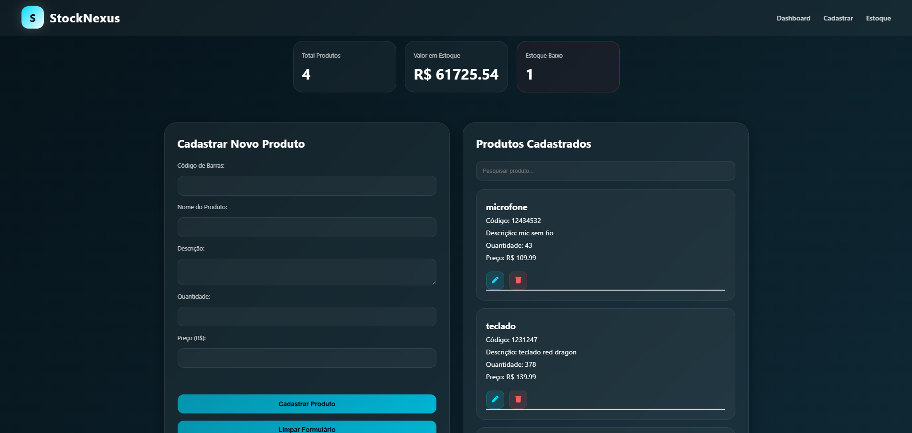

# StockNexus

Sistema de gerenciamento de estoque desenvolvido com JavaScript, Node.js, Express e SQLite.

O projeto permite cadastrar, visualizar, pesquisar, editar e remover produtos através de uma interface moderna e dinâmica, simulando o funcionamento de sistemas reais de controle de estoque.

---

# Preview



---

# Funcionalidades

* Cadastro de produtos
* Listagem dinâmica
* Pesquisa em tempo real
* Edição de produtos
* Exclusão com confirmação
* Dashboard com métricas
* Alerta visual de estoque baixo
* API REST com Express
* Banco de dados SQLite

---

# Tecnologias

## Frontend

* HTML
* CSS
* JavaScript

## Backend

* Node.js
* Express.js

## Banco de Dados

* SQLite3

---

# Como executar

## Instalar dependências

```bash
npm install
```

## Iniciar servidor

### Com Nodemon

```bash
npx nodemon server.js
```

### Ou com Node

```bash
node server.js
```

---

# API

```http
GET    /produtos
POST   /produtos
PUT    /produtos/:id
DELETE /produtos/:id
```

---

# Estrutura do Projeto

```txt
StockNexus/
│
├── frontend/
│   ├── index.html
│   ├── style.css
│   └── script.js
│
├── backend/
│   ├── server.js
│   ├── database.js
│   ├── database.db
│   └── package.json
```

---

# Autor

Desenvolvido por Matheus Victor 🚀
